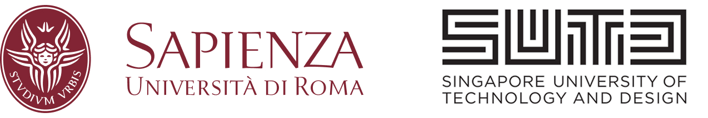

# EMANUELE RUCCI - Thesis Project (Temp Readme) 
Thesis developed in Singapore university of technology and design, for the course of Artificial Intelligence and Robotics held in Sapienza, University of Rome.



## Overview
This repository contains the materials and code for my Master's thesis project. The project focuses on [brief description of your thesis topic].

## Table of Contents
- [Introduction](#introduction)
- [Installation](#installation)
- [Usage](#usage)
- [Contributing](#contributing)
- [License](#license)

## Introduction
[Provide a more detailed introduction to your thesis project, including the problem statement, objectives, and significance of the research.]

## Installation
To set up the project locally, follow these steps:

1. Clone the repository:
    ```sh
    git clone https://github.com/yourusername/your-repo-name.git
    ```
2. Navigate to the project directory:
    ```sh
    cd your-repo-name
    ```
3. Install the required dependencies:
    ```sh
    [Provide installation commands, e.g., pip install -r requirements.txt]
    ```

## Usage
[Provide instructions on how to use the code or run the experiments. Include examples if possible.]

## Contributing
Contributions are welcome! Please follow these steps to contribute:

1. Fork the repository.
2. Create a new branch:
    ```sh
    git checkout -b feature/your-feature-name
    ```
3. Commit your changes:
    ```sh
    git commit -m 'Add some feature'
    ```
4. Push to the branch:
    ```sh
    git push origin feature/your-feature-name
    ```
5. Open a pull request.

## License
This project is licensed under the [MIT License](LICENSE).

## Contact
For any questions or feedback, please contact [your email address].
